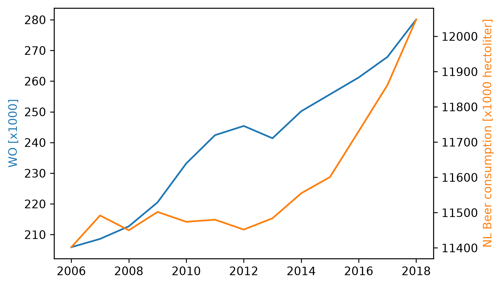

# Homework assignment CS toolbox lecture  

Student ID: 17067863

## Paper references
MCC Van Dyke et al., 2019:  Fantastic yeasts and where to find them: the hidden diversity of dimorphic fungal pathogens
JT Harvey, Applied Ergonomics, 2002: An analysis of the forces required to drag sheep over various surfaces
DW Ziegler et al., 2005:  The neurocognitive effects of alcohol on adolescents and college students

## Plot

The plot shows a positive correlation between the beer consumed per year and WO per year. However, from this data, it cannot be concluded that there is a causal link between the two.
